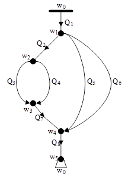

# One dimensional air flow simulation for an underground mine

## 1. Compile and run

At the moment there are 2 mods of simulation: sequential for 1 edge and sequential for entire network. In order to compile progam you need to have boost library installed (boost 1.66). 
To compile program that allows output debug information you need to specify -DDEBUG option.

__Sequential single-edge simulator:__


``g++ -DDEBUG sequential.cpp -o sequential.out``

``./sequential.out Edge_n.json`` --- _where n should be substituted with a desired edge number_

For our test system, we have 8 edges, hence 8 .json files for sequential single-edge simulator. JSON config file structure is describe below.

---

__Sequential network simulator__

``g++ -DDEBUG network.cpp network_debug.cpp -o network.out``

``./network.out Network.json``

Only 1 Network.json file exist. It's structure a little bit different from a single-edge config files, which is also described below.

---

## 2. Visualization

__Sequential single-edge simulator__

To simulate a particular edge, execute

``./sequential.out [edge_config.json]``

Where [edge_config.json] identifies a JSON file which is located in the root directory. Please choose over an existing files.

---

Correct single-edge simulator would create 6 files that describe edge state at each single time point. 3 files for flow (Q) and 3 files for pressure (P).
Naming conversion is as follow: ``E6_single_Pplots_e.txt``. E6 means that we are simulating 6th edge, ``Pplots`` means that plots inside a file measure a pressure
and ``e`` means ``end``. Progam plots 3 spatial steps for a single timestep. 

``s`` stands for start - meaning first spatial step 

``m`` stands for middle - middle spatial step

``e`` stands for end - last spatial step

This set of files is used by gnuplot to create graphics.

After a successfull execution, we need to run:

``./graph.sh [edge_name]``

The [edge_name] should be equal to "name" field in the JSON file for a choosen edge. You do not need to type all 6 file names in order to graph them. Just go:

``./graph.sh E6_single``

The script will automatically detect other files for particular edge and will notify you in case if some of them does not exist. It should generate 2 .png images - E6_single_P.png and E6_single_Q.png

Warning: sometimes gnuplot might generate warning message "line 0: warning: Skipping data file with no valid points", nothing bad about it, just skip it.

---

__Sequential network simulator__

Network simulator works pretty much the same with 1 exception, it takes only 1 JSON file named Network.json

``./network.out Network.json``

Eventually, it will generate the same set of debug files (6 per edge) but for all edges. It is a lot of files. Additionally, with -DDEBUG option we would have 2 more files in project root directory. One with a name TestNetwork.dot and one TestNetwork_Vertices.txt.
TestNetwork.dot will contain text information about our test graph. It is needed to double check the graph structure by eye and make sure that everything connected right.

First of all, to check graph correctness you need a graphviz installed, depending on your system use:

``sudo apt install graphviz``

To generate an image of a graph just execute:

``dot -Tpng TestNetwork.dot -o TestNetwork.png``

It should look exactly like our initial graph:



The second file is relevant if you want to check default gamma coefficients in each vertex. I will write about it later.

---

After successfull simulation, you will have a bunch of files for each edge. To visualize them all you have to exectute them file by file via ./graph.sh. The naming conversion is little bit different from single-edge simulator, now if you want to generate 
graphics for edge, say, 3, write

``./graph.sh E3``

For a whole graph you need:

```
./graph.sh E0 
./graph.sh E1
./graph.sh E2
./graph.sh E3
./graph.sh E4
./graph.sh E5
./graph.sh E6
./graph.sh E7
```

Note: for network simulator edge numbering starts from 0, not 1 as it was for single-edge simulator.

Now you should have 2 images per one edge for an entire system.

--- 

__Cleaning__

To clean up all this mess go:

``rm -rf *plots*.txt *.png *.out *single* TestNetwork*``

## 3. Configuration file structure

To be continued...

## 4. Sequential single-edge simulator 

To be continued...

## 5. Sequential network simulator

To be continued...

